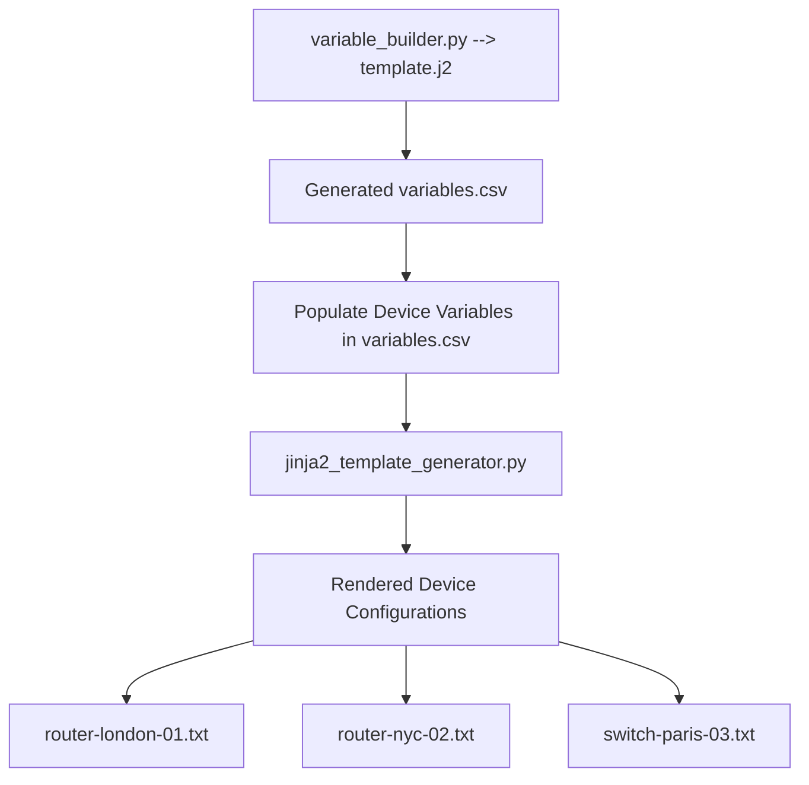
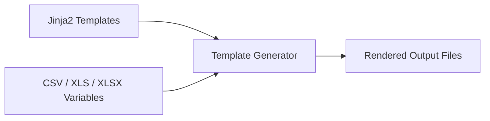

# config-template-engine


A pair of cross-platform Python 3 command-line tools for generating and rendering [Jinja2](https://jinja.palletsprojects.com/) configuration templates at scale.

| Script | Purpose |
|--------|---------|
| `variable_builder.py` | Scans a Jinja2 template and generates a blank CSV with the correct column headers |
| `render_template.py` | Reads a populated variables file (CSV / XLS / XLSX) and renders one output file per row |

**Typical workflow:** run `variable_builder.py` once to scaffold the CSV → fill in your data → run `render_template.py` to produce all rendered files.

---

# Workflow Diagram



---

# Architecture Overview



---

## Requirements

- Python 3.7 or later
- pip

---

## Installation

```bash
# 1. Clone the repository
git clone https://github.com/TheNetworkAlchemist/config-template-engine/
cd config-template-engine

# 2. (Recommended) Create and activate a virtual environment
python3 -m venv .venv

# macOS / Ubuntu
source .venv/bin/activate

# Windows
.venv\Scripts\activate

# 3. Install dependencies
pip install -r requirements.txt
```

> **Note:** `render_template.py` will also auto-install any missing packages on first run. `variable_builder.py` uses the Python standard library only and needs no extra packages.

---

## Tool 1 — `variable_builder.py`

Parses a `.j2` or `.jinja2` template, extracts every `{{ variable }}` placeholder, and writes a blank CSV with those variables as column headers — ready for you to populate with data.

### Usage

```
python3 variable_builder.py [template_file]
```

The template path is optional. Resolution order:

1. **CLI argument** — `python3 variable_builder.py mytemplate.j2`
2. **Auto-detect** — looks for `template.j2` in the current directory
3. **Interactive prompt** — asks for the path if nothing is found

### Output

A blank CSV is written to:

```
output_configs/variables.csv
```

The directory is created automatically if it does not exist.

### Example

Given a template `router.j2`:

```jinja2
hostname={{ HOSTNAME }}
ip_address={{ ip_address }}
location={{ location }}
role={{ role }}
```

Running:

```bash
python3 variable_builder.py router.j2
```

Produces `output_configs/variables.csv`:

```csv
HOSTNAME,ip_address,location,role
```

Fill in the rows, then pass the file to `render_template.py`.

---

## Tool 2 — `render_template.py`

Reads a variables file and a Jinja2 template, then renders one output `.txt` file per row in the variables file.

### Usage

```
python3 render_template.py [variables_file] [template_file]
```

Both arguments are optional. Each is resolved independently using the same three-step priority:

1. **CLI argument**
2. **Auto-detect** in the script's directory (first matching file found)
3. **Interactive prompt**

| File type | Auto-detect pattern |
|-----------|---------------------|
| Variables | First `.csv`, `.xls`, or `.xlsx` found |
| Template  | First `.j2`, `.jinja2`, `.jinja`, or `.tmpl` found |

### Example Script Usage

```bash
# Explicit — pass both files
python3 render_template.py variables.csv router.j2

# Semi-explicit — specify only the variables file; template is auto-detected
python3 render_template.py variables.xlsx

# Auto-detect — drop all three files in the same folder and just run
python3 render_template.py

# Fully interactive — no files present; tool prompts for both paths
python3 render_template.py
```

### Output Naming

Rendered files are written to a date-stamped folder created alongside the script:

```
rendered_template_YYYY-MM-DD/
```

The output filename for each row is determined as follows:

| Condition | Output filename |
|-----------|----------------|
| Variables file has a `HOSTNAME` or `hostname` column | `<hostname>.txt` (special characters are sanitised) |
| No hostname column present | `template-01.txt`, `template-02.txt`, … |

### Example

Variables file `variables.csv`:

```csv
HOSTNAME,ip_address,location,role
router-london-01,10.0.1.1,London,core
router-nyc-02,10.0.2.1,New York,edge
switch-paris-03,10.0.3.1,Paris,access
```

Template file `router.j2`:

```jinja2
hostname={{ HOSTNAME }}
ip_address={{ ip_address | default('UNCONFIGURED') }}
location={{ location | default('UNKNOWN') }}
role={{ role | default('generic') }}

interface Loopback0
 description Management loopback
 ip address {{ ip_address }} 255.255.255.255

router bgp 65000
 neighbor {{ ip_address }} remote-as 65001

```

Output:

```
rendered_template_2025-06-01/
├── router-london-01.txt
├── router-nyc-02.txt
└── switch-paris-03.txt
```

---

## Jinja2 Template Reference

All standard Jinja2 syntax is supported inside `.j2` templates:

| Feature | Syntax | Example |
|---------|--------|---------|
| Variable | `{{ name }}` | `{{ HOSTNAME }}` |
| Filter | `{{ name \| filter }}` | `{{ ip \| default('0.0.0.0') }}` |
| Conditional | ` … ` | `` |
| Loop | ` … ` | `` |
| Comment | `{# comment #}` | `{# generated config #}` |

---

## Advanced Jinja2 Examples

### Switch Port Template Example

```jinja2
{# CHANGE TYPE TO INTEGER #}



{# RANGE IS I THROUGH J-1 #}
{# ADD 1 TO COMPUTE PROPER RANGE #}



{# LOOP THROUGH EACH SWITCH IN THE STACK #}
{# !!! CHANGE STARTING VALUE IF FIXED SWITCH AND NUMBER STARTS AT 0 !!! #}

	
	{# LOOP THROUGH EACH PORT IN THE SWITCH #}
	
!
interface GigabitEthernet{{ switch }}/0/{{ port }}
 switchport access vlan {{ data_vlan }}
 switchport voice vlan {{ voice_vlan }}
	
!

!
```
### Switch Port Template Example With Uplinks

```jinja2
{# CHANGE TYPE TO INTEGER #}




{# RANGE IS I THROUGH J-1 #}
{# ADD 1 TO COMPUTE PROPER RANGE #}




{# LOOP THROUGH EACH SWITCH IN THE STACK #}
{# !!! CHANGE STARTING VALUE IF FIXED SWITCH AND NUMBER STARTS AT 0 !!! #}

	
	{# LOOP THROUGH EACH PORT IN THE SWITCH #}
	
!
interface GigabitEthernet{{ switch }}/0/{{ port }}
 switchport access vlan {{ data_vlan }}
 switchport voice vlan {{ voice_vlan }}
	
!
	{# LOOP THROUGH EACH UPLINK PORT IN THE SWITCH #}
	
!
interface GigabitEthernet{{ switch }}/1/{{ uplink_port }}
 shutdown
!
	

!
```

### VLAN Template Example

```jinja2
## ASSUME VLANS ARE LISTED IN FOLLOWING FORMAT
## {vlan_number}:{vlan_name},{vlan_number}:{vlan_name}
## EXAMPLE: 10:data,20:voice

!
{# SPLIT VLAN LIST, COMMA DELIMINATED #}


	{# SPLIT VLAN ITEMS, COLON DELIMINATED #}
	
{# SELECT ITEM BY INDEX NUMBER #}
vlan {{ vlan_items[0] }}
 name {{ vlan_items[1] }}

!
```


### Conditional Statements
```jinja2
{# IF 'device_type' IS EQUAL TO 'router_mpls' THEN SET BELOW #}

hostname rtr-mpls
!

```

```jinja2
{# IF 'device_type' IS EQUAL TO 'router_inet' THEN SET BELOW #}

hostname rtr-inet
!
{# IF 'device_type' IS EQUAL TO ANY OTHER VALUE THEN SET BELOW #}

hostname unknown
!

```

```jinja2
{# CHECK IF DEVICE TYPE IS SOMETHING OTHER THAN EMPTY #}

hostname {{ hostname }}
!

```

```jinja2
{# CHECK IF DEVICE TYPE IS EMPTY #}

hostname missing
!

```


```jinja2
{# ALTERNATIVELY, CHECK IF DEVICE TYPE IS EMPTY #}

    device_type is not empty

    device_type is empty

```


---

## Project Structure

```
jinja2-template-toolkit/
├── README.md                      # This file
├── requirements.txt               # Python dependencies
├── variable_builder.py            # Step 1 — scaffold your variables CSV
├── render_template.py             # Step 2 — render templates from your CSV
├── example_template.j2            # Sample Jinja2 template
├── example_variables.csv          # Sample variables file
```

---

## Platform Notes

| Platform | Notes |
|----------|-------|
| **Windows 11** | Run from Command Prompt or PowerShell. Use `.venv\Scripts\activate` to activate the virtual environment. Forward slashes typed at interactive prompts are converted automatically. |
| **macOS** | Use `python3` (not `python`). If pip fails, install Xcode Command Line Tools: `xcode-select --install` |
| **Ubuntu** | Install prerequisites first if needed: `sudo apt install python3-pip python3-venv` |

---

## Troubleshooting

**`ModuleNotFoundError` on startup**
Install dependencies manually if the auto-install fails (e.g. in a restricted environment):
```bash
pip install -r requirements.txt
```

**`xlrd` errors on `.xlsx` files**
`xlrd` only supports the legacy `.xls` format. Use `.xlsx` files with `openpyxl` — the generator selects the correct engine automatically based on file extension.

**Output filenames contain underscores instead of special characters**
Filename sanitisation replaces any character that is not alphanumeric, `-`, `_`, or `.` with `_` to ensure compatibility across all three platforms.

**`variable_builder.py` finds no variables**
Confirm your template uses standard `{{ variable_name }}` syntax. Variables inside `` block tags (e.g. loop targets) are not extracted — only `{{ }}` expression placeholders are.

**`variable_builder.py` finds no roles and other jinja2 values**
This is a **known limitation** in variable_builder.py where it will not 'create' a jinja2 role heading in the variables.csv.  This heading will need to be manually added.  There could be additional missing values.  

**Render errors appear inside output files**
If a row causes a Jinja2 render error, the generator writes a `# RENDER ERROR` comment into that file and continues processing the remaining rows so a single bad row does not halt the entire run.

---

# Future Improvements

Potential enhancements:

- Adjust `variable_builder.py` and `render_template.py` output folder locations
- Additional error handling
- Additional internal documentation
- Additional example files with associated `variables.csv`
- File Overwrite protection
- Add capability of `variable_builder.py` to detect any .csv as a default
- Update examples to remove excessive whitespace in rendered templates

---

## License

MIT License — see [LICENSE](LICENSE) for details.
